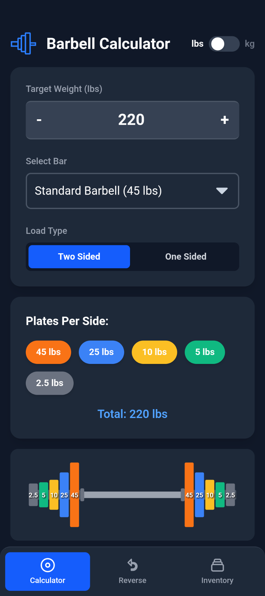
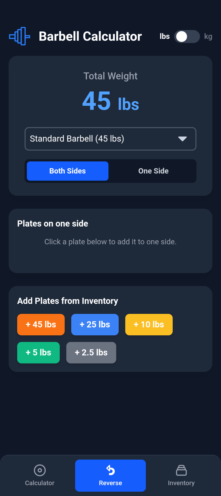

## Barbell Calculator

💪🏻 If you can do mental plate math in the gym, you aren't lifting heavy enough. 💪🏻

## Installation
For now, go to the [releases](https://github.com/benmordecai/BarbellCalc/releases/) page. Might have a Play Store or Apple Store release eventually, but for now it is only available on the releases page. 

## Features
- No adds, no trackers, all open source. GPL license.
- Choice between two-sided calculations or one-sided (For exercises where one side of the bar is loaded like landmine rows).
- Choice between different bars to load.
- Ability to load "No Bar" for machines.
- Customize your inventory of plates and bars. 
- Plates can be color coded to match your collection
- Pounds are default units, but kilograms are supported. Conversions occur automatically so it is recommended that you delete inventory of pound-denominated equipment and create new inventory with kg if applicable.
- Reverse calculations supported
- Reasonable looking visualization.
- Smart increment/decrement

## Screenshots

 

